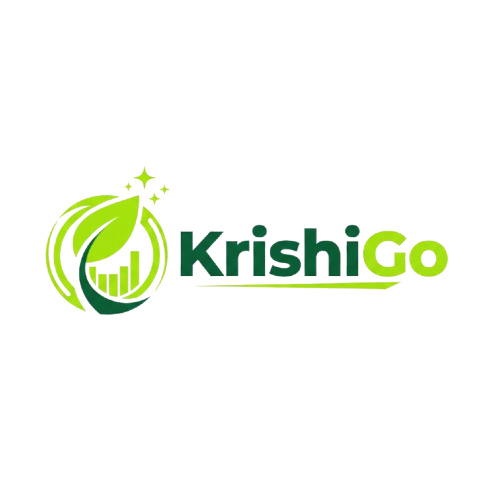
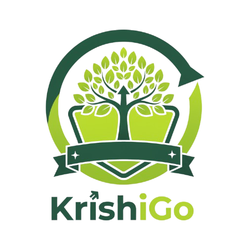

# 🌱 KrishiGo - Gamified Learning for Sustainable Agriculture

<div align="center">



**Transforming Agriculture Education Through Gamification**

*Empowering Young Farmers and Agricultural Enthusiasts with Interactive Learning*

---

## 📱 Download Now

<div style="background: linear-gradient(45deg, #4CAF50, #8BC34A); padding: 20px; border-radius: 15px; margin: 20px 0;">
  <h3 style="color: white; text-align: center; margin: 0;">🚀 Get KrishiGo APK</h3>
  <p style="color: white; text-align: center; margin: 10px 0;">Experience the future of agricultural learning!</p>
  
  **[📥 DOWNLOAD APK](https://expo.dev/artifacts/eas/moybGR6df2bufCkfUFSGrU.apk)**
</div>

</div>

## 🎯 What is KrishiGo?

KrishiGo is a revolutionary **gamified learning platform** designed specifically for young farmers and agricultural enthusiasts. Our app combines education with entertainment, making sustainable agriculture practices engaging and rewarding.



## ✨ Key Features

### 🎮 Interactive Learning Experience
- **Quiz-based Learning**: Master agricultural concepts through engaging quizzes
- **AI Assistant**: Get instant help and guidance from our smart AI companion
- **Progress Tracking**: Monitor your learning journey with detailed analytics


### 🏆 Reward System
- **Points & Badges**: Earn rewards for completing courses and quizzes
- **Leaderboards**: Compete with friends and climb the rankings
- **Daily Rewards**: Collect points every day to stay motivated
- **Referral Program**: Invite friends and earn bonus points


### 📚 Comprehensive Curriculum
- **Sustainable Agriculture**: Learn eco-friendly farming practices
- **Modern Techniques**: Discover latest agricultural technologies
- **Best Practices**: Master proven farming methodologies
- **Environmental Impact**: Understand the ecological aspects of farming

## 🌟 Why Choose KrishiGo?

### 🎯 **Gamified Learning**
Transform boring agricultural theory into exciting, interactive experiences

### 🤖 **AI-Powered Support**
Get personalized assistance and instant answers to your questions

### 🏅 **Achievement System**
Stay motivated with badges, points, and recognition for your progress

### 📊 **Progress Analytics**
Track your sustainability score and learning achievements

### 👥 **Community Driven**
Connect with fellow learners and compete in friendly challenges

## 📱 App Screenshots

<div align="center">
  <table>
    <tr>
      <td></td>
      <td></td>
      <td></td>
      <td></td>
    </tr>
    <tr>
      <td align="center"><b>AI Assistant</b></td>
      <td align="center"><b>Interactive Quizzes</b></td>
      <td align="center"><b>Reward System</b></td>
      <td align="center"><b>Personal Dashboard</b></td>
    </tr>
  </table>
</div>

## 🚀 Getting Started

1. **Download the APK** from the link above
2. **Install** the app on your Android device
3. **Create your account** and set up your profile
4. **Start learning** with our interactive courses
5. **Earn rewards** and climb the leaderboards!

## 🛠️ Technical Details

- **Platform**: Android
- **Language**: JavaScript (100%)
- **Architecture**: Modern mobile app framework
- **Features**: Offline support, AI integration, Real-time leaderboards

## 📊 App Performance

- ⭐ **Sustainability Score Tracking**: Monitor your farming knowledge growth
- 🎯 **Achievement System**: Unlock badges like "First Harvest" and "Green Thumb"
- 📈 **Progress Analytics**: Detailed insights into your learning journey
- 🏆 **Competitive Learning**: Leaderboards to motivate continuous improvement

## 🤖 AI Assistant Features

Our intelligent AI companion helps you:
- Answer agricultural questions instantly
- Provide personalized learning recommendations
- Guide you through complex farming concepts
- Offer real-time support during quizzes

## 🎨 User Experience

KrishiGo offers a beautiful, intuitive interface with:
- **Clean Design**: Modern UI with agricultural themes
- **Easy Navigation**: Smooth user experience across all features
- **Responsive Layout**: Optimized for various screen sizes
- **Engaging Animations**: Delightful interactions that keep you engaged

---
------------------------------

## 🧩 Project Structure

```
krishigo/
├── 📁 ai/
│   ├── ai_api.js
│   ├── ai_contest.js
│   └── ai_firebase.js
│
├── 📁 api/
│   │
│   ├── 📁 challenges/
│   │   └── challenges_firebase.js
│   │
│   ├── 📁 courses/
│   │   ├── all_courses_service.js
│   │   └── courses_service.js
│   │
│   ├── 📁 quizs/
│   │   └── quiz_service.js
│   │
│   └── 📁 user/
│       ├── login_firebase.js
│       ├── register_firebase.js
│       ├── user_courses.js
│       └── user_service.js
│
├── 📁 app/
│   ├── index.jsx
│   ├── MainLayout.jsx
│   └── NavBar.jsx
│
├── 📁 assets/
│   ├── 📁 fonts/
│   └── 📁 images/
│
├── 📁 components/
│   ├── 📁 AlComponents/
│   │   ├── AlChatSpace.jsx
│   │   └── FloatingAlbution.jsx
│   │
│   ├── 📁 ChallengeComponents/
│   │   ├── ChallengePopup.jsx
│   │   └── ChallengeUpload.jsx
│   │
│   ├── 📁 CoursesComponents/
│   │   ├── CourseDetails.jsx
│   │   ├── CourseVideo.jsx
│   │   ├── SavedCourses.jsx
│   │   └── SearchCourses.jsx
│   │
│   ├── 📁 RedeemComponents/
│   │   ├── CouponModal.jsx
│   │   ├── GadgetsModal.jsx
│   │   ├── RedeemScreen.jsx
│   │   └── UplModal.jsx
│   │
│   ├── 📁 SettingsComponents/
│   │   ├── ChangedLanguageModal.jsx
│   │   ├── DeleteAccModal.jsx
│   │   ├── EditAccountModal.jsx
│   │   ├── EditProfilePhoto.jsx
│   │   └── Settings.jsx
│   │
│   ├── About.jsx
│   ├── TermsAndConditions.jsx
│   ├── ProgressLine.jsx
│   ├── Quiz.jsx
│   ├── RewardPopUp.jsx
│   └── RoundProgress.jsx
│
├── 📁 config/
│   ├── firebase.js
│   └── i18n.js
│
├── 📁 functions/
│   └── ai_image.js
│
├── 📁 hooks/
│   ├── DataContext.js
│   └── useLanguage.js
│
├── 📁 locales/
│   ├── en.json
│   ├── hi.json
│   ├── ml.json
│   └── ta.json
│
├── 📁 screens/
│   │
│   ├── 📁 LoginScreen/
│   │   ├── Login.jsx
│   │   └── Register.jsx
│   │
│   ├── ChallengeScreen.jsx
│   ├── HomeScreen.jsx
│   ├── JourneyScreen.jsx
│   ├── ProfileScreen.jsx
│   └── RewardsScreen.jsx
│
├── 📁 utils/
│   └── format.js
│
├── .env
├── .gitignore
├── app.json
├── babel.config.js
├── eslint.config.js
├── global.css
├── jsconfig.json
├── metro.config.js
├── package-lock.json
├── package.json
├── README.md
└── tailwind.config.js

```

## 🔄 Backend Data Structure

### User Management

```js
{
  "users": {
    "userId": {
      "authId": "authId123", // Firebase Authentication UID
      "email": "user@example.com",
      "fullName": "John Doe",
      "profilePicture": "https://example.com/profile-picture.jpg",
      "phoneNumber": "+1234567890",
      "address": {
        "street": "123 Main Street",
        "city": "New York",
        "state": "NY",
        "zipCode": "10001",
        "country": "USA"
      },
      "rewards": {
        "totalPoints": 8490,
        "redeemedPoints": 2000
      },
      "enrolledCourses": [
        {
          "courseId": "courseId1",
          "progress": 50, // Progress in percentage
          "completedModules": ["moduleId1", "moduleId2"],
          "enrolledAt": "2025-09-10T08:00:00Z",
          "lastAccessed": "2025-09-15T09:00:00Z"
        }
      ],
      "achievements": [
        {
          "achievementId": "achievement1",
          "title": "First Course Completed",
          "description": "Completed your first course on KrishiGo.",
          "earnedAt": "2025-08-20T09:00:00Z"
        }
      ],
      "preferences": {
        "language": "en",
        "notificationsEnabled": true
      },
      "createdAt": "2025-09-01T08:00:00Z",
      "updatedAt": "2025-09-15T09:00:00Z"
    }
  }
}
```

### Course Management

```js
{
  "courses": {
    "courseId": {
      "title": "Introduction to Organic Farming",
      "description": "Learn the basics of organic farming and sustainable agriculture.",
      "category": "Agriculture",
      "level": "Beginner",
      "duration": 120, // in minutes
      "price": 500, // in currency units
      "thumbnail": "https://example.com/thumbnail.jpg",
      "videoUrl": "https://example.com/video.mp4",
      "instructor": {
        "name": "John Doe",
        "bio": "An expert in organic farming with 10+ years of experience.",
        "profilePicture": "https://example.com/johndoe.jpg"
      },
      "modules": [
        {
          "moduleId": "moduleId1",
          "title": "Introduction",
          "type": "video",
          "duration": "6 min"
        },
        {
          "moduleId": "moduleId2",
          "title": "Advanced Techniques Quiz",
          "type": "quiz",
          "duration": "12 min"
        }
      ],
      "createdAt": "2025-09-14T08:00:00Z",
      "updatedAt": "2025-09-15T09:00:00Z"
    }
  }
}
```

### Quiz Structure

```js
{
  "quizzes": {
    "quizId1": {
      "moduleId": "moduleId3", // Reference to the parent module
      "title": "Quiz on Best Practices",
      "questions": [
        {
          "questionId": "questionId1",
          "question": "What is the best time to harvest crops?",
          "options": [
            "Early morning",
            "Afternoon",
            "Evening",
            "Night"
          ],
          "correctAnswer": "Early morning"
        }
      ],
      "createdAt": "2025-09-14T08:00:00Z",
      "updatedAt": "2025-09-15T09:00:00Z"
    }
  }
}
```

### Rewards System

```js
{
  "rewards": {
    "rewardId1": {
      "category": "money", // Category: money, coupons, or gadgets
      "title": "UPI Transfer",
      "description": "Direct UPI money transfer",
      "pointsRequired": 1000, // Points needed to redeem
      "value": "₹100", // Reward value
      "type": "upi", // Type of reward (e.g., upi, amazon, earbuds)
      "icon": "cash-outline", // Icon name for UI
      "createdAt": "2025-09-14T08:00:00Z",
      "updatedAt": "2025-09-15T09:00:00Z"
    }
  }
}
```
-----

<div align="center">

## 🌱 Join the Agricultural Revolution!

**Ready to transform your farming knowledge?**

### [📥 DOWNLOAD KRISHIGO APK NOW](https://expo.dev/artifacts/eas/moybGR6df2bufCkfUFSGrU.apk)

---

*Made with 💚 for sustainable agriculture*

**Repository**: [mohanapriyan2006/KrishiGo](https://github.com/mohanapriyan2006/KrishiGo)

</div>

-------------------------------
